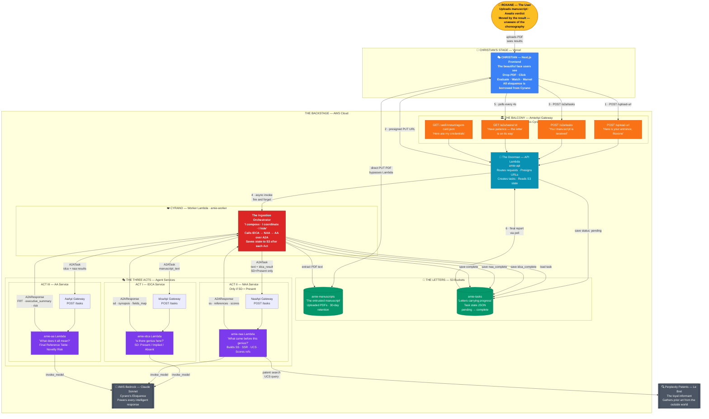
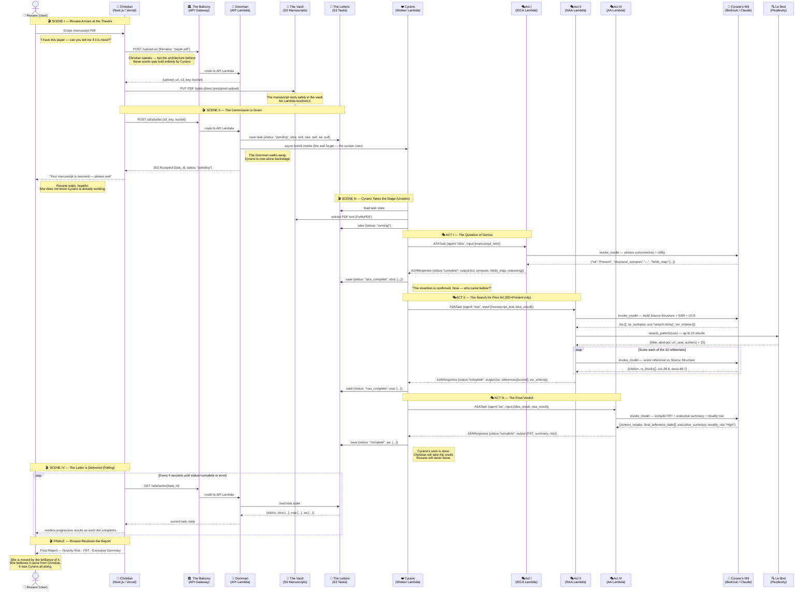
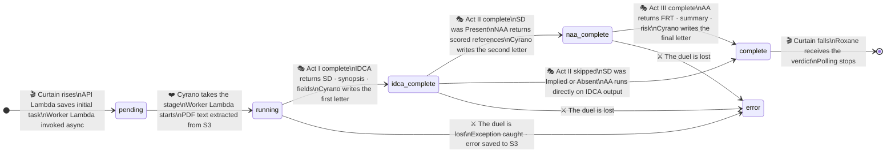
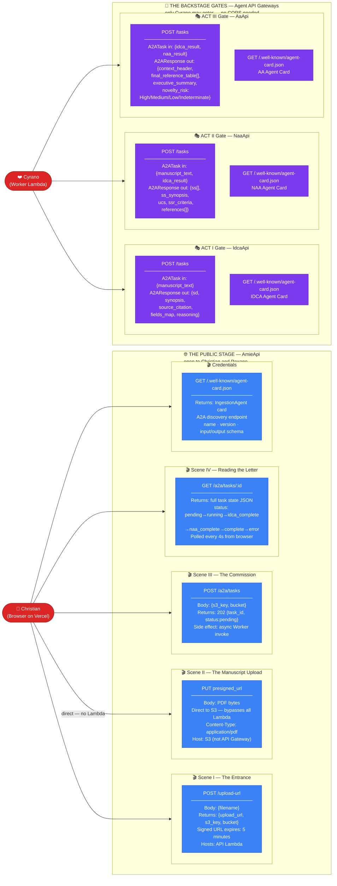

# 🎭 AMIE — Architecture Through the Lens of Cyrano de Bergerac

> *"The best part of me is what I whisper through another's lips."*
> — Cyrano de Bergerac

---

## The Metaphor

In Edmond Rostand's play, **Cyrano de Bergerac** is the brilliant, eloquent swordsman-poet who composes beautiful words for the handsome but intellectually hollow **Christian** to speak to the beautiful **Roxane**. Roxane falls in love with what she believes is Christian's soul — never suspecting that the true author stands hidden in shadow.

**AMIE** is built on exactly this three-party choreography.

| Play Character | AMIE Component | What They Do |
|---|---|---|
| **Roxane** | The User | Receives the final report, moved by its brilliance, unaware of the backstage choreography |
| **Christian** | Next.js Frontend on Vercel | The visible, beautiful face — but intellectually hollow without Cyrano's words |
| **Cyrano** | Worker Lambda / Ingestion Orchestrator | The hidden genius composing every analysis, coordinating every agent, never taking credit |
| **The Balcony** | AWS API Gateway | The architectural boundary where the visible world meets the hidden one |
| **The Letters** | S3 Buckets | The medium carrying Cyrano's words between scenes — state persisted after every act |
| **The Three Cadets** | IDCA, NAA, AA Agents | Cyrano's three skills, each deployed as a separate Act of the analysis |
| **Cyrano's Eloquence** | AWS Bedrock / Claude Sonnet | The wit and intelligence powering every intelligent response |
| **Le Bret** | Perplexity Patents API | The loyal friend who gathers intelligence from the outside world |
| **The Stage** | AWS Cloud | The theatre in which the backstage magic happens, invisible to Roxane |

---

## Diagram 1 — The Full Stage: Complete System Architecture

> *"The entire theatre is our canvas — some of it seen, most of it hidden."*

This diagram shows every component, its metaphorical role, and every connection in the system.
Color legend: 🟡 Roxane/User · 💙 Christian/Frontend · ❤️ Cyrano/Orchestrator · 🟣 Agent Lambdas · 🟢 S3/Letters · 🟠 API Gateway/Balcony · ⚫ External APIs



---

## Diagram 2 — The Performance: Communication Flow Sequence

> *"Every word I speak through him is a word he cannot earn himself."*

This sequence shows the exact order of events from the moment Roxane drops her PDF to the moment the final report appears — narrated as scenes of a play.



---

## Diagram 3 — The Letters: Task State & S3 Data Flow

> *"Each letter carries more than words — it carries the progress of my soul."*

S3 is not just a database here — it is the **narrative medium** of the play. Every state change Cyrano makes is written into a letter in S3. Christian (via the API Lambda) reads those letters to report back to Roxane. The agents never talk to each other directly — they pass their findings through Cyrano, who records every step.



### What the S3 Letter looks like at each stage

```
PENDING                        IDCA_COMPLETE                   COMPLETE
──────────────────────         ─────────────────────────────   ─────────────────────────────────
{                              {                               {
  task_id: "uuid",               task_id: "uuid",                task_id: "uuid",
  status:  "pending",            status:  "idca_complete",        status:  "complete",
  s3_key:  "uploads/...",        idca: {                          idca:    { sd, synopsis... },
  idca:    null,                   sd:       "Present",           naa:     { ss, references...},
  naa:     null,                   synopsis: "...",               aa: {
  aa:      null,                   fields_map: [...],               context_header: {...},
  error:   null                    reasoning:  "..."                final_reference_table: [...],
}                              },                                   executive_summary: "...",
                                 naa:  null,                        novelty_risk: "High"
                                 aa:   null                       }
                               }                               }
```

---

## Diagram 4 — The Scenes: API Endpoint Map

> *"Each door leads to a different world — some open to Roxane, some only to me."*

There are **two API Gateway stages** in AMIE: the public-facing `AmieApi` (where Christian and Roxane interact) and the backstage agent gateways (where only Cyrano is allowed to enter).



---

## Diagram 5 — The Three Acts: Agent Orchestration Detail

> *"First I must know if there is something worth defending. Then I must know if it has been said before. Only then can I render judgment."*

Each agent is a separate AWS Lambda with its own API Gateway. They do not know each other exists — only Cyrano orchestrates their order and passes results between them.

```mermaid
flowchart TD
    Input(["📄 Manuscript Text\nExtracted from S3 PDF\nTruncated to 40,000 chars for IDCA\n30,000 chars for NAA"])

    subgraph Act1["🎭 ACT I — IDCA Lambda (amie-idca)\n'Is there genius here?'\nModel: Claude Sonnet via Bedrock · max_tokens: 2000"]
        I_prompt["Prompt: Assess concreteness + utility\nAssign SD · Generate synopsis\nGenerate APA citation · Map fields"]
        I_out["Output:\nsd: Present / Implied / Absent\nstructural_synopsis: actor→operation→outcome\nsource_citation: APA style\nfields_map: 3–8 domain strings\nreasoning: why this SD was assigned"]
    end

    Decision{"SD = Present?"}
    SkipNote["SD = Implied or Absent\nNAA is skipped entirely\nAA runs with naa_result = null"]

    subgraph Act2["🎭 ACT II — NAA Lambda (amie-naa)\n'What came before this genius?'\nModel: Claude Sonnet · max_tokens: 4096 · Up to 11 Bedrock calls"]

        subgraph StepA["Step A: Build Source Structure"]
            N_ss["Claude call #1\nDecompose invention into SS blocks:\narchitecture · energy/drive · transfer_elements\nrouting_guidance · compliance_safety\nsensing_measurement · external_observation\ncontrol_decision · materials_build\n+SSR weights (1-3) +UCS search string"]
        end

        subgraph StepB["Step B: Prior Art Search"]
            N_search["Perplexity Patents API\nQuery: UCS string\nReturns: up to 10 references\n{title, abstract, url, year, authors}"]
        end

        subgraph StepC["Step C: Score Each Reference"]
            N_score["Claude calls #2–#11 (one per reference)\nFor each SS block: Present/Partial/Absent/Unknown\nCSS = conservative score (Unknown=0)\nEWSS = evidence-weighted (excludes Unknown)\nBoth scores computed per reference"]
        end

        N_out["Output:\nss[]: source structure blocks + weights\nss_synopsis: actor→operation→outcome\nucs: unified composite search string\nssr_criteria: match criteria per block\nreferences[]: each with css · ewss · rs_blocks · url"]
    end

    subgraph Act3["🎭 ACT III — AA Lambda (amie-aa)\n'What does it all mean?'\nModel: Claude Sonnet · max_tokens: 4096"]
        A_prompt["Prompt: Compile context header\nBuild Final Reference Table\nsort by EWSS descending\nWrite executive summary (2–4 sentences)\nAssign overall novelty risk"]
        A_out["Output:\ncontext_header: {source_citation, ss_synopsis, sd, fields_map}\nfinal_reference_table[]: sorted by EWSS desc\n  each row: citation · rs_synopsis · css · ewss · url\nexecutive_summary: 2–4 sentences on novelty risk\nnovelty_risk: High / Medium / Low / Indeterminate"]
    end

    FinalReport(["📊 Final Report\nWritten to S3 {status: complete}\nPolled and rendered by Christian\nDelivered to Roxane"])

    Input --> I_prompt --> I_out
    I_out --> Decision
    Decision -->|"Yes — Act II begins"| StepA
    Decision -->|"No — Act II skipped"| SkipNote
    SkipNote --> A_prompt
    StepA --> StepB --> StepC --> N_out
    N_out --> A_prompt
    A_prompt --> A_out --> FinalReport

    classDef act1node fill:#3b82f6,stroke:#1d4ed8,color:#fff
    classDef act2node fill:#7c3aed,stroke:#5b21b6,color:#fff
    classDef act3node fill:#059669,stroke:#047857,color:#fff
    classDef ioNode fill:#f97316,stroke:#c2410c,color:#fff,font-weight:bold
    classDef decNode fill:#dc2626,stroke:#991b1b,color:#fff,font-weight:bold
    classDef skipNode fill:#6b7280,stroke:#374151,color:#fff

    class I_prompt,I_out act1node
    class N_ss,N_search,N_score,N_out act2node
    class A_prompt,A_out act3node
    class Input,FinalReport ioNode
    class Decision decNode
    class SkipNote skipNode
```



---

## Narrative: Connecting Metaphor to Behavior

### Why this metaphor works perfectly

**Christian cannot write the letter — he delivers it.**
The frontend (`page.tsx`) contains zero AI logic. It uploads a file, creates a task, and polls. Every word of the final report was authored by agents it never calls directly.

**Cyrano composes in secret — the user never sees him.**
The Worker Lambda is invoked asynchronously. The API returns `202` before Cyrano has read a single line of the manuscript. He works entirely in shadow, writing progress into S3 letters that Christian reads to Roxane every four seconds.

**The letters travel between worlds.**
S3 is not a database — it is the narrative medium. Cyrano writes `idca_complete` into a letter. Roxane (via Christian) reads it and sees the IDCA card appear on screen. The letter travels from backstage to front of house without either party ever speaking directly.

**The balcony is the only interface between the two worlds.**
API Gateway is the architectural balcony scene. Christian stands on the Vercel side, calling down to Cyrano's world. The four routes (`/upload-url`, `/a2a/tasks`, `/a2a/tasks/:id`, `/.well-known/agent-card.json`) are the four lines Christian is allowed to speak.

**The three cadets each play their part and leave the stage.**
IDCA does not know NAA exists. NAA does not know AA exists. Each agent is invoked, responds with its A2AResponse, and exits. Only Cyrano holds the full picture — routing results from one act to the next, deciding whether Act II is even needed.

**Roxane is moved by the report — she believes in Christian.**
The user sees a beautiful Next.js UI, a progress bar advancing through stages, a final report with CSS/EWSS scores and an executive summary. She does not know there are five separate Lambda functions, three API Gateways, two S3 buckets, one Perplexity API call, and up to eleven Bedrock invocations behind that "Evaluate Novelty" button.

That is the Cyrano architecture. The performance is flawless precisely because the performer is invisible.

---

## Technical Appendix — The Facts Without Poetry

| Component | Technology | Purpose |
|---|---|---|
| Frontend | Next.js 16 on Vercel | UI: upload, poll, display |
| API Gateway | AWS HTTP API (AmieApi) | Public-facing routes |
| API Lambda | Python 3.10 (amie-api) | Route, presign, create task, poll |
| Worker Lambda | Python 3.10 (amie-worker) | Orchestrate IDCA→NAA→AA pipeline |
| IDCA Lambda | Python 3.10 (amie-idca) | Invention detection + classification |
| NAA Lambda | Python 3.10 (amie-naa) | Prior art search + scoring |
| AA Lambda | Python 3.10 (amie-aa) | Aggregation + final report |
| Agent Gateway | AWS HTTP API × 3 | One per agent, internal only |
| S3 Manuscripts | AWS S3 | PDF storage, 30-day TTL |
| S3 Tasks | AWS S3 | Task state store, 7-day TTL |
| LLM | Claude Sonnet via AWS Bedrock | Powers all three agent calls |
| Patent Search | Perplexity Sonar API | Prior art retrieval for NAA |
| Agent Protocol | A2A (custom minimal impl.) | A2ATask / A2AResponse over HTTP POST |
| Task Polling | Browser setInterval 4s | Frontend polls GET /a2a/tasks/:id |
| IAM | Single shared LambdaRole | S3 + Bedrock + Lambda invoke |
| Infrastructure | AWS SAM (template.yaml) | All resources defined as code |
