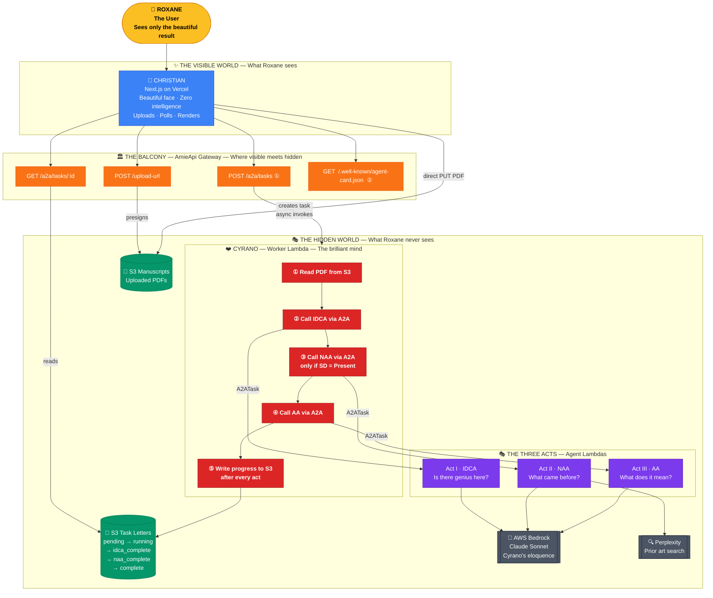
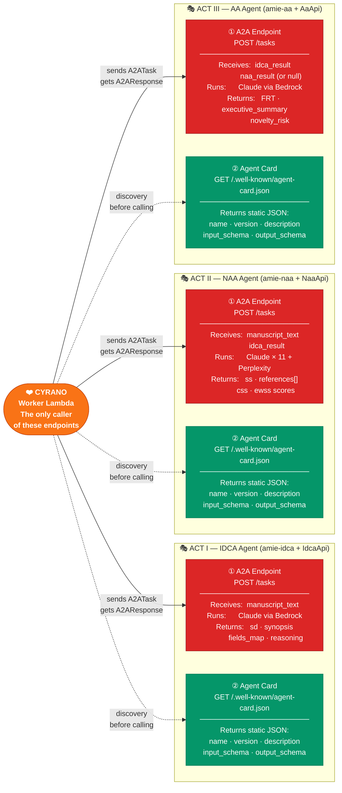
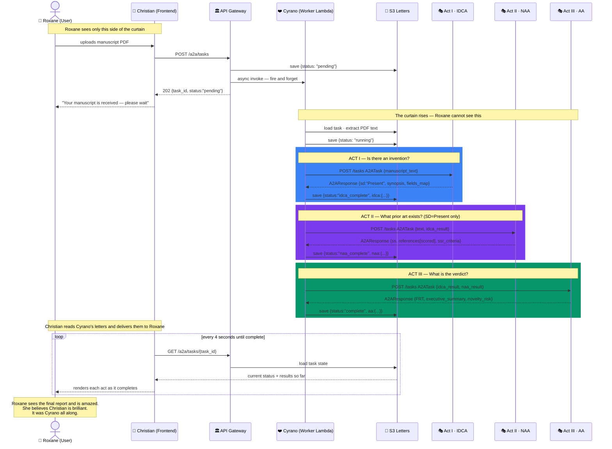
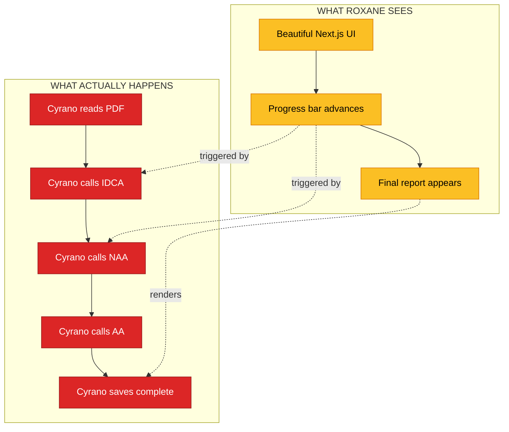

# AMIE – System Architecture

## Illustration 1 — The Two Worlds: Visible vs Hidden

---

## Illustration 2 — The Two Endpoints on Every Agent

Every agent in the system exposes exactly two endpoints. One receives work (A2A), one advertises capability (Agent Card).

---

## Illustration 3 — Cyrano's Role: The Full Pipeline Walk-through

---

## The Core Insight in One Picture

